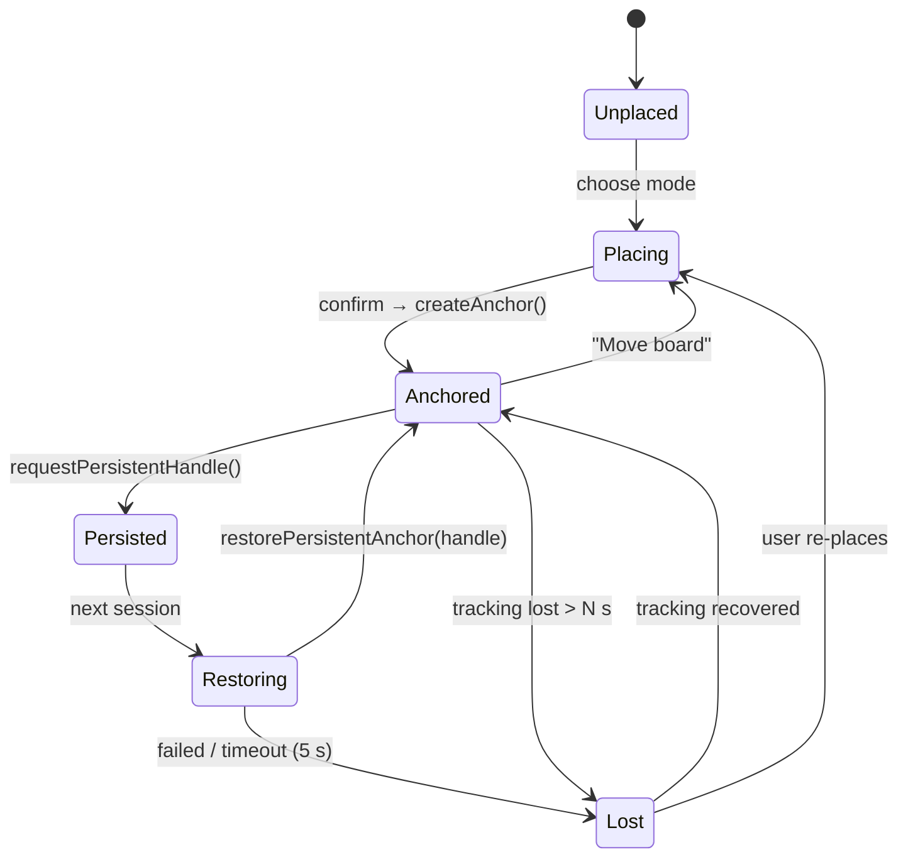
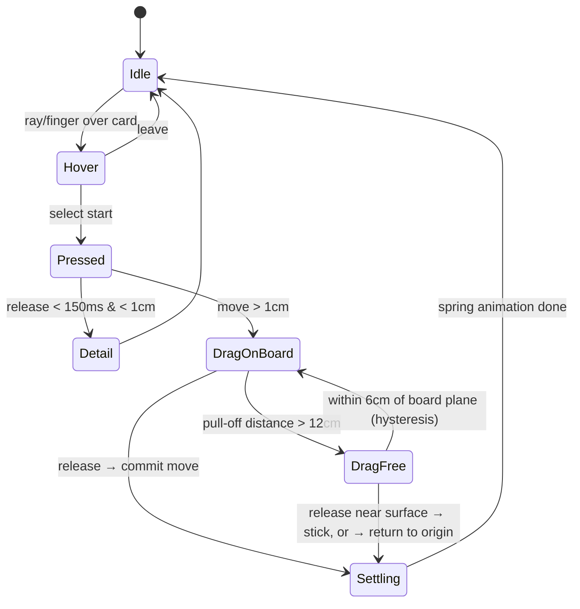
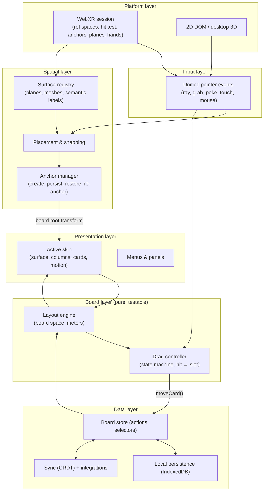

# Spatial Kanban — Product & Technical Plan

A WebXR kanban board that lives in your real space. Stick it to a wall, lay it on your desk, or leave it floating beside you, then grab cards with your hands or controllers and move them between columns. The board can wear different **skins**: a clean GitHub Projects–style board, or a whiteboard covered in sticky notes.

> Status: planning · Last updated: 2026-09-28

---

## Table of contents

1. [Vision](#1-vision)
2. [Goals and non-goals](#2-goals-and-non-goals)
3. [Target platforms](#3-target-platforms)
4. [Core user experience](#4-core-user-experience)
5. [Anchoring the board](#5-anchoring-the-board)
6. [Interaction design](#6-interaction-design)
7. [Skins](#7-skins)
8. [Architecture](#8-architecture)
9. [Data model](#9-data-model)
10. [Tech stack](#10-tech-stack)
11. [Project structure](#11-project-structure)
12. [Rendering and performance](#12-rendering-and-performance)
13. [Comfort, readability, and accessibility](#13-comfort-readability-and-accessibility)
14. [Persistence, sync, and collaboration](#14-persistence-sync-and-collaboration)
15. [Testing strategy](#15-testing-strategy)
16. [Roadmap](#16-roadmap)
17. [Risks and open questions](#17-risks-and-open-questions)

---

## 1. Vision

Physical kanban boards work because they take up space: you can see the whole board at a glance from across the room, and moving a sticky note feels like finishing something. Digital boards gave up that presence to get sync, history, and integrations.

Spatial Kanban tries to keep both. The board is a real object in your room that stays where you put it. You work it with your hands, and underneath it's still a proper data model that can sync, persist, and connect to tools like GitHub.

**One-sentence pitch:** *A kanban board you pin to your wall in mixed reality, where every card is something you can pick up.*

---

## 2. Goals and non-goals

### Goals

- **Anchor anywhere.** Put the board on a wall, on a desk, or floating in space, and have it stay put between sessions where the platform allows.
- **Direct manipulation.** Grab, drag, drop, throw, and tear cards off the board using hands, controllers, or touch.
- **Swappable skins.** The same board data can render as a GitHub-style board, a sticky-note whiteboard, or future skins, and you can switch live.
- **Web-first.** No install. Open a URL, tap "Enter AR", and you're working.
- **Graceful fallback.** The same site works as a 3D desktop view and a plain 2D board on devices without WebXR (for example iOS Safari).
- **Local-first.** Works offline, with sync layered on top.

### Non-goals (for v1)

- Full parity with GitHub Projects, Jira, or Linear (custom fields, automations, reports).
- Shared co-located sessions where two headsets see the *same physical* anchor. Collaboration shares *data*; each person places their own copy of the board.
- Native app builds (Unity, visionOS). These may come later, but v1 is WebXR only.
- Rich text or markdown editing inside XR. Long-form editing happens in the 2D view.

---

## 3. Target platforms

WebXR capability varies a lot by device. The app detects features at runtime and turns off what isn't available.

| Platform | Session | Hit test | Anchors | Persistent anchors | Plane / mesh detection | Hands | Priority |
|---|---|---|---|---|---|---|---|
| **Meta Quest 3 / 3S / Pro** (Quest Browser) | `immersive-ar` (passthrough) | ✅ | ✅ | ✅ (Meta extension) | ✅ with semantic labels (wall, table, …) from Space Setup | ✅ | **Primary** |
| **Android Chrome** (ARCore phones) | `immersive-ar` + DOM overlay | ✅ | ✅ | ❌ | ⚠️ limited / behind flags | ❌ (touch) | Secondary |
| **Apple Vision Pro** (Safari) | `immersive-vr` today; verify current AR support | ⚠️ | ⚠️ | ❌ | ❌ | ✅ + `transient-pointer` (gaze + pinch) | Secondary, verify at build time |
| **Desktop browsers** | Non-XR 3D (orbit camera) | — | — | — | — | Mouse | Fallback / dev |
| **iOS Safari** | No WebXR | — | — | — | — | Touch | 2D fallback only |

> ⚠️ Browser support changes often. Re-check this table against current docs before starting each phase, and ship with feature detection, not user-agent sniffing.

**Design implication:** Build and tune the full experience on Quest first. Then make sure every feature has a fallback path, such as manual placement when plane detection is missing, or re-placing the board when persistent anchors are unavailable.

---

## 4. Core user experience

### First-run flow

```
Open site ─▶ 2D board (works everywhere)
             │
             ├─ "Enter AR" (if immersive-ar supported)
             │     │
             │     ▼
             │  Choose placement:  [ Wall ]  [ Desk ]  [ Float ]
             │     │
             │     ▼
             │  Ghost board follows your gaze/hand, snapping to detected surfaces
             │     │
             │     ▼
             │  Pinch / trigger / tap to place ─▶ Anchor created (persisted if possible)
             │     │
             │     ▼
             │  Adjust: drag bar to move, corners to resize ─▶ "Done"
             │     │
             │     ▼
             │  Work the board: grab, move, create, edit cards
             │
             └─ "3D view" (desktop, no XR): orbit around the board with a mouse
```

### Returning flow (Quest)

1. Enter AR.
2. The app restores the saved persistent anchor, and the board shows up where you left it.
3. If restoring fails (a different room, or the room map was reset), the app shows a "Board not found here — place it again?" prompt. The board comes back with its last size and skin.

### Primary jobs to be done

| Job | How it works in space |
|---|---|
| See the state of work at a glance | The board sits at real-world scale on your wall and can be read from your desk |
| Move a task forward | Grab the card, drag it to the next column, and let go |
| Add a task quickly | Pull a blank card from the "pad" at the board's corner, then dictate or type the title |
| Look at details | Tap a card to open a detail panel beside the board |
| Park something | Tear a card off the board and stick it on your monitor bezel or desk |
| Change the look | Open the board menu and pick a skin; the board morphs between skins |

---

## 5. Anchoring the board

### 5.1 Placement modes

| Mode | Surface | Board orientation | Detection strategy | Defaults |
|---|---|---|---|---|
| **Wall** | Vertical plane | Flush with the wall, offset 5 mm to avoid z-fighting, kept upright by gravity | 1. Plane detection with `semanticLabel === 'wall'` 2. Hit test whose normal is roughly horizontal 3. Manual placement | Center about 1.45 m above the floor, 1.6 m × 1.0 m |
| **Desk** | Horizontal plane (table or desk) | Lying flat, or tilted 0–30° like a drafting table so it faces you | 1. Plane detection with `semanticLabel === 'table'` (or `'desk'`) 2. Hit test whose normal is roughly vertical 3. Manual placement | Fits inside the desk polygon, 0.6 m × 0.4 m, 15° tilt |
| **Float** | None (world-locked) | Faces you at the moment of placement, yaw only | Pose in front of you, then anchor | 1.2 m in front of you, at chest height |
| **Room** *(stretch)* | Several walls | Each column on its own wall section | Plane detection | — |

### 5.2 Surface snapping algorithm

For each frame during placement:

1. **Collect candidate hits** from:
   - a hit test source on the active input's `targetRaySpace` (controller or hand ray), or on the viewer space for phone AR;
   - a raycast against `frame.detectedPlanes`, when available.
2. **Classify each hit by its surface normal.** A hit test pose's +Y axis is the surface normal.
   - `|n · up| < 0.3` means vertical, so it's a wall candidate.
   - `n · up > 0.9` means horizontal and facing up, so it's a desk or floor candidate. Reject it if the height is below 0.4 m, which is probably the floor.
3. **Filter by the selected mode.** Prefer semantically labeled planes when they exist.
4. **Build the board pose:**
   - **Wall:** the forward axis is the wall normal, and the up axis is world up projected onto the wall plane. This keeps the board from tilting even when the wall's hit normal is noisy.
   - **Desk:** start from the plane normal, then rotate about the board's local X axis by the tilt angle. The board's "up" edge points away from the user.
5. **Smooth** the ghost pose with a critically damped spring to prevent jitter, and snap to the plane edges when you're within 3 cm.
6. **Confirm** on select, and create an anchor at that pose.

```ts
// Sketch: placing on confirmation
async function placeBoard(frame: XRFrame, hit: XRHitTestResult | null, pose: XRRigidTransform, refSpace: XRReferenceSpace) {
  const anchor = hit?.createAnchor
    ? await hit.createAnchor()                  // anchor attached to the tracked surface
    : await frame.createAnchor?.(pose, refSpace); // free anchor at a pose

  if (anchor && 'requestPersistentHandle' in anchor) {
    const handle = await anchor.requestPersistentHandle(); // Meta Quest extension
    await placements.save({ boardId, handle, mode, size, localOffset });
  }
  return anchor;
}

// Each frame: read the anchor's pose and apply it to the board root
const p = frame.getPose(anchor.anchorSpace, refSpace);
if (p) boardRoot.matrix.fromArray(p.transform.matrix);
```

> Note: the pose you place at and the anchor's pose may differ slightly (the hit anchor attaches to the surface). Keep a `localOffset` transform between the anchor and the board so you can adjust the board later without making a new anchor.

### 5.3 Anchor lifecycle



- **Tracking loss:** freeze the board at its last good pose and fade it to 50% opacity. Don't hide it.
- **Adjusting after placement:** moving or resizing only changes `localOffset` and `size`. If the board moves more than 1 m from its anchor, re-anchor it, because anchors are most accurate near where they were made.
- **Cleanup:** when a board is deleted or re-placed, call `session.deletePersistentAnchor(handle)` on the old handle so stale anchors don't pile up.
- **No anchors API:** fall back to a pose relative to `local-floor`. This works within one session, and the board has to be placed again each time.

### 5.4 Board sizing

- **Wall:** start at the default size, then let the user drag corner handles. Aspect ratio is free, but the board keeps a minimum size so each column stays at least 25 cm wide.
- **Desk:** auto-fit to the largest rectangle inside the detected table polygon, with a 5 cm margin.
- **Scale presets:** *Poster* (wall, readable from 3 m), *Desk* (arm's reach), and *Compact* (floating mini board).
- Layout is computed in **meters**, so real-world size is the truth. The skin decides how much content fits.

---

## 6. Interaction design

### 6.1 Input matrix

| Input | Near (≤ ~40 cm) | Far | Select | Secondary |
|---|---|---|---|---|
| Hand tracking (Quest) | Pinch-grab or poke on a card | Hand ray + pinch | Pinch | Palm-up menu |
| Controllers | Grip button inside a card | Laser + trigger | Trigger | Thumbstick scrolls a column, B opens the menu |
| Vision Pro | Pinch on a gazed card (`transient-pointer`) | Same | Pinch | Long pinch |
| Phone AR | Touch drag on screen (raycast from tap) | Same | Tap | Long-press |
| Desktop 3D / 2D | Mouse drag | — | Click | Right-click |

The input layer turns all of these into a single **pointer event** model (`pointerdown`, `pointermove`, `pointerup`, carrying the ray, the pointer type, and grab strength). Board logic never checks which device it's running on.

### 6.2 Gestures and actions

| Action | Gesture |
|---|---|
| Pick up a card | Grab or pinch it |
| Move a card within or between columns | Drag along the board; the card stays constrained to the board plane |
| Drop | Release. The card snaps into the highlighted slot |
| Tear off a card | Pull it more than 12 cm away from the board. It detaches and becomes free |
| Stick a free card somewhere | Release it near a surface; it snaps and anchors there |
| Return a free card | Drag it back onto the board |
| Archive a card | Throw it downward quickly, or drop it on the board's "done bin" |
| Create a card | Grab the top sheet from the blank pad at the board's corner and drop it into a column |
| Open card details | Tap or select without dragging (under 150 ms and under 1 cm of movement) |
| Reorder columns | Grab a column header and drag it sideways |
| Scroll a long column | Thumbstick, or swipe along the column with a poke or two fingers |
| Move the board | Grab the handle bar under the board |
| Resize the board | Drag a corner handle |
| Scale or rotate the board | Two-handed grab on the frame |

### 6.3 Drag state machine



### 6.4 Drag mechanics

- **Project to board space.** While a card is on the board, project the pointer ray onto the board plane to get board coordinates `(u, v)` in meters. All drop logic works in this 2D space, so it's pure and testable.
- **Lift.** A grabbed card rises 1.5 cm off the board, grows 5%, and casts a stronger shadow. The skin can tilt it with drag velocity (sticky notes do).
- **Target column.** Pick the column whose x-range contains `u`. Add 2 cm of hysteresis at the edges so the target doesn't flicker.
- **Insertion index.** Compare `v` against the midpoints of the target column's cards, leaving out the dragged card. Show a placeholder gap there, and animate the other cards into place with springs.
- **WIP limit feedback.** If the target column is at its limit, its header glows amber and the drop still goes through. Blocking the drop is optional.
- **Commit.** On release, the store gets one `moveCard(cardId, toColumnId, newOrderKey)` action, and the view animates to match. Moves are optimistic; there's no waiting on the network.
- **Haptics and audio.** Give a light haptic tick when the target column changes, a firmer one on drop, and play a skin-specific sound (a soft click, or a paper slap).

### 6.5 Text input in XR

Typing is the weakest part of XR, so the plan uses several paths:

1. **Voice dictation** through the Web Speech API where it's available. You hold a mic button on the card or pad.
2. **A virtual keyboard** in 3D, near the hand or on the desk, for short titles.
3. **The system keyboard**, where the browser shows one for focused DOM inputs (Quest DOM layers, and phone AR with DOM overlay).
4. **A 2D companion view** on the same account and board for long descriptions. Changes sync live.

---

## 7. Skins

### 7.1 Principle: data and presentation are separate

A skin is a **pure presentation plugin**. It gets the board state and the computed layout, and it decides:

- the board surface (material, frame, and background);
- how columns look (headers, separators, counts, WIP indicators);
- how cards look (geometry, face content, colors, and which fields show);
- layout rules (spacing, card size, how overflow works, allowed jitter);
- motion (how cards lift, fly, and settle);
- audio and haptics.

A skin **never** changes board data. Anything skin-specific, like a sticky note's rotation, is either derived deterministically (seeded by card id) or stored in a namespaced `skinData` field.

```ts
interface Skin {
  id: 'github' | 'sticky' | string;
  name: string;

  // Layout: pure function, board space in meters → rects
  layout(board: BoardView, size: Vec2, opts: LayoutOpts): BoardLayout;

  // Rendering (React Three Fiber components)
  Surface: React.FC<SurfaceProps>;
  ColumnHeader: React.FC<ColumnProps>;
  Card: React.FC<CardProps>;          // receives state: idle | hover | dragging | ghost
  DropIndicator: React.FC<DropProps>;

  // Behavior tuning
  motion: { liftHeight: number; spring: SpringConfig; dragTilt: number };
  overflow: 'scroll' | 'stack' | 'shrink';
  sounds?: Partial<Record<'pick' | 'drop' | 'tear' | 'stick', string>>;

  // Card → visual mapping
  cardColor(card: Card, board: Board): Color;
  visibleFields: Array<keyof Card>;
}
```

### 7.2 Skin: "Projects" (GitHub-style)

A clean, flat, information-dense board modeled on GitHub Projects' board view.

| Element | Treatment |
|---|---|
| Board surface | A rounded panel with a slight frosted-glass look over passthrough. Light and dark variants |
| Columns | Rounded "lanes" with a slightly different background tint. The header shows a status dot, the column name, the card count, and the WIP limit (e.g. `3 / 5`) |
| Cards | Rounded rectangles about 2 mm thick with a hairline border. They show the issue/status icon, `#123` reference, title (up to 3 lines), label pills, assignee avatars, and optional due date |
| Typography | Sans-serif rendered with SDF, sharp at any distance |
| Color | Neutral cards. Color comes only from labels and status dots |
| Overflow | The column scrolls, with a fade mask at the edges |
| Motion | Tight and quick (spring stiffness 400, damping 35). No tilt. Cards lift straight up |
| Sound | Soft UI clicks |
| Best for | Software teams, and boards synced with GitHub |

### 7.3 Skin: "Whiteboard" (sticky notes)

A physical, playful whiteboard covered in paper sticky notes.

| Element | Treatment |
|---|---|
| Board surface | A glossy white melamine surface with a faint reflection, a thin aluminum frame, and a marker tray on the bottom edge |
| Columns | Headings in a hand-drawn marker font (e.g. *Permanent Marker* or *Caveat*), with columns separated by slightly wobbly hand-drawn vertical lines |
| Cards | Square paper notes, 7.6 cm (3″) at 1:1 by default, scalable for wall readability. A small bottom-corner curl is made by bending the vertices, plus a soft contact shadow |
| Card content | The title in a handwritten font. Labels become colored dots or a small doodle, not pills |
| Color | Note color comes from the first label, or a per-card color. Default palette: canary yellow, pink, blue, green, orange, all tuned for color-blind distinguishability, with an optional icon per color |
| Imperfection | Each note gets a rotation of ±3° and position jitter of ±4 mm, seeded by card id so it's stable across sessions and devices |
| Overflow | Notes overlap and stack like a real pile. When you hover, the pile fans out |
| Freeform option | In "loose" mode, notes can sit anywhere inside a column (the offset is stored in `skinData.sticky`). Column membership and order still come from the canonical data |
| Motion | Loose and physical. The note peels up from its bottom edge when grabbed, sways with velocity while dragged, and slaps down on drop with a small squash |
| Sound | A paper peel on pick-up and a soft slap on drop |
| Extras *(stretch)* | Marker annotations: draw on the whiteboard with a finger or controller, with strokes saved as board-space polylines |
| Best for | Personal boards, brainstorms, and retros |

### 7.4 Future skin ideas

- **Corkboard:** index cards pinned with push pins, and yarn between linked cards to show dependencies.
- **Chalkboard:** dark slate with chalk text, and dusty smears when a card moves.
- **Holo:** minimal floating glass cards with no board surface, for the float mode.
- **Blueprint:** technical-drawing style for engineering roadmaps.

### 7.5 Skin switching

- Switch skins live from the board menu. Both layouts are computed, and each card animates from its old rect to its new one over about 600 ms. During the switch, cards cross-fade materials (or flip over to show the new face).
- The skin choice is saved **per placement**, so the same board could be a whiteboard on your wall and Projects on your desk.

---

## 8. Architecture



### Key architectural decisions

1. **Board space is a 2D coordinate system in meters.** Layout, hit testing, and drop logic all happen in 2D board space. The 3D board root, whose transform comes from the anchor and offset, is the only place 3D comes in. This makes the hard logic unit-testable without a headset.
2. **The store is the single source of truth.** Views never own data. Drag previews are *transient view state*, and only the final drop becomes a store action.
3. **Actions are small and serializable** (`createCard`, `moveCard`, `updateCard`, `moveColumn`, and so on). That makes undo/redo, sync, and integrations straightforward.
4. **Placement is per device, data is shared.** A `Placement` record (anchor handle, mode, size, skin) belongs to a device and never syncs as spatial truth.
5. **Capability detection drives features.** A `capabilities` object is filled in at session start (`anchors`, `persistentAnchors`, `planes`, `hands`, `domOverlay`, …), and each feature checks it.

---

## 9. Data model

```ts
type ID = string; // ULID

interface Board {
  id: ID;
  title: string;
  columnIds: ID[];            // column order
  labels: Label[];
  createdAt: string;
  updatedAt: string;
  integration?: { provider: 'github' | 'trello' | 'linear' | 'jira'; remoteId: string; name: string; url?: string };
}

interface Column {
  id: ID;
  boardId: ID;
  title: string;
  color?: string;
  wipLimit?: number;
  externalId?: string;        // remote column: GitHub Status option, Trello list, Linear/Jira status
}

interface Card {
  id: ID;
  boardId: ID;
  columnId: ID;
  orderKey: string;           // fractional index — reorder without renumbering
  title: string;
  description?: string;       // markdown, edited in 2D
  labelIds: ID[];
  assignees: Person[];
  dueDate?: string;
  color?: string;             // explicit color override (sticky skin)
  archived: boolean;
  externalRef?: { provider: ProviderId; id: string; url?: string; key?: string; meta?: Record<string, string> };
  skinData?: {                // presentation hints, namespaced per skin
    sticky?: { offset?: [number, number]; rotation?: number };
  };
  createdAt: string;
  updatedAt: string;
}

interface Label { id: ID; name: string; color: string; icon?: string }
interface Person { id: string; name: string; avatarUrl?: string }

// Device-local, never synced as shared truth
interface Placement {
  id: ID;
  boardId: ID;
  deviceId: string;
  mode: 'wall' | 'desk' | 'float';
  anchorHandle?: string;       // persistent anchor UUID, if supported
  localOffset: Pose;           // anchor → board root
  size: [number, number];      // meters
  tiltDeg?: number;            // desk mode
  skinId: string;
  updatedAt: string;
}

// Cards torn off the board and stuck elsewhere in the room
interface FreeCardPlacement {
  cardId: ID;
  deviceId: string;
  anchorHandle?: string;
  localOffset: Pose;
}
```

**Ordering:** Use fractional indexing (e.g. the `fractional-indexing` package) for `orderKey`. Moving a card creates one key between its new neighbors, so there's no renumbering and concurrent edits don't conflict.

---

## 10. Tech stack

| Concern | Choice | Why | Alternatives considered |
|---|---|---|---|
| Language | **TypeScript** | Typed WebXR APIs and safer refactors | — |
| Build / dev server | **Vite** + HTTPS (`@vitejs/plugin-basic-ssl` or mkcert) | Fast HMR. WebXR requires a secure context | Next.js (not needed for a single-page app) |
| 3D | **three.js** via **React Three Fiber** | Large ecosystem, and declarative scenes suit a data-driven board | Babylon.js (strong WebXR support, but less React-friendly); A-Frame (quick, but awkward for complex state) |
| XR | **@react-three/xr** (pmndrs) | Session management, hit test, anchors, planes, hands, and one pointer-event system across grab, ray, and touch | Raw WebXR (more control, more code) |
| Manipulation handles | **@react-three/handle** (pmndrs) | Move, rotate, and scale handles for the board frame | Custom |
| 3D UI (menus, panels) | **@react-three/uikit** | Flexbox layout in 3D for menus and the detail panel | Custom meshes |
| Text | **troika-three-text** (SDF) | Sharp text at any distance, with batching | Canvas textures (blurry up close) |
| Animation | **@react-spring/three** or a custom spring | Physically based card motion | GSAP |
| State | **Zustand** (plus Immer) | Small, fast, and works outside React for the per-frame XR loop | Redux Toolkit |
| Local persistence | **IndexedDB** via **Dexie** | Offline-first and structured | localStorage (too small) |
| Sync *(phase 3)* | **Yjs** + y-websocket / y-indexeddb | CRDT with offline merge | Liveblocks, PartyKit, Automerge |
| Integrations backend *(built)* | **Cloudflare Worker** + **D1** | Serves the app and a small OAuth/API proxy on one origin; tokens never reach the browser | A separate Node server |
| 2D fallback UI | React + dnd-kit | Uses the same store and actions | — |
| Testing | **Vitest**, **Playwright**, **IWER** | See §15 | — |

> A native engine like Unity would give deeper platform access, such as scene APIs and shared spatial anchors. It's out of scope because the goal is a zero-install web experience.

### Session request

```ts
const session = await navigator.xr!.requestSession('immersive-ar', {
  requiredFeatures: ['local-floor'],
  optionalFeatures: [
    'hit-test', 'anchors', 'plane-detection', 'mesh-detection',
    'hand-tracking', 'dom-overlay', 'layers',
  ],
  domOverlay: { root: document.getElementById('xr-overlay')! }, // phone AR HUD
});
```

Keep as much optional as possible so the session starts on the widest range of devices. Then read `session.enabledFeatures` to fill in the `capabilities` object.

---

## 11. Project structure

```
spatial-kanban/
├─ index.html
├─ vite.config.ts
├─ src/
│  ├─ main.tsx
│  ├─ app/                    # routing, top-level mode switch (2D / 3D / XR)
│  ├─ data/
│  │  ├─ model.ts             # types from §9
│  │  ├─ store.ts             # Zustand store + actions
│  │  ├─ ordering.ts          # fractional index helpers
│  │  ├─ persistence.ts       # Dexie schema + load/save
│  │  └─ sync/                # Yjs binding (not built)
│  ├─ integrations/           # built: protocol, three-way sync planner, engine, API client
│  ├─ xr/
│  │  ├─ capabilities.ts      # feature detection
│  │  ├─ session.tsx          # XR store/provider, enter/exit
│  │  ├─ surfaces.ts          # planes/meshes registry, semantic filtering
│  │  ├─ placement/           # placement flow, snapping, ghost board
│  │  └─ anchors.ts           # create / persist / restore / re-anchor
│  ├─ board/
│  │  ├─ space.ts             # board-space math (ray → uv, uv → world)
│  │  ├─ layout.ts            # layout engine (pure)
│  │  ├─ drag.ts              # drag state machine (pure)
│  │  ├─ BoardRoot.tsx        # applies anchor transform, renders active skin
│  │  └─ FreeCards.tsx        # torn-off cards anchored in the room
│  ├─ skins/
│  │  ├─ types.ts             # Skin interface
│  │  ├─ registry.ts
│  │  ├─ projects/            # GitHub-style skin
│  │  └─ whiteboard/          # sticky-note skin (+ shaders, fonts, sounds)
│  ├─ ui/
│  │  ├─ xr/                  # 3D menus, detail panel, keyboard, pad
│  │  └─ flat/                # 2D fallback board (dnd-kit)
│  └─ assets/                 # fonts (MSDF), sounds, textures
├─ tests/
│  ├─ unit/                   # layout, drag, ordering, snapping math
│  └─ e2e/                    # Playwright + IWER
└─ PLAN.md
```

---

## 12. Rendering and performance

**Budget:** a steady 72–90 fps on Quest 3, with fewer than 150 draw calls and under 200k triangles for a board of about 150 cards.

| Technique | Applies to |
|---|---|
| **Instanced meshes** for card bodies (one `InstancedMesh` per skin card geometry) | Both skins |
| **Batched SDF text** (troika `BatchedText`) so each column's text isn't dozens of draw calls | Both skins |
| **Only the dragged card leaves the instance batch**, so it can animate and deform on its own | Drag |
| **LOD:** beyond about 3 m, or at small angular size, show only colored blocks and titles; drop avatars and labels | Wall mode |
| **Frustum and occlusion culling:** hide the insides of scrolled-away columns | Projects skin |
| **Baked contact shadows** (a simple blob quad under each card) instead of real-time shadow maps | Both skins |
| **Passthrough-friendly materials:** avoid full-screen transparency and keep overdraw low | Board surface |
| **Fixed foveation** (`session.updateTargetFrameRate`, `xrLayer.fixedFoveation`) where supported | Quest |
| **Per-frame work outside React:** anchor pose updates and drag math run in `useFrame` and read Zustand with `getState()`, so they don't trigger re-renders | XR loop |

---

## 13. Comfort, readability, and accessibility

### Readability

- **Target text size:** body text x-height should cover at least **~0.3°** of view. That's about 8 mm at 1.5 m, or about 16 mm at 3 m.
- Scale presets set content density for the expected viewing distance. Wall "Poster" mode shows fewer fields and bigger text.
- A **"bring closer"** gesture (double-tap a card) temporarily flies a large copy of the card to arm's length.

### Comfort

- The default wall height centers the board a little below standing eye level, and desk mode tilts toward the seated user.
- All actions can be done seated and with one hand.
- Nothing is head-locked except a small, optional HUD for phone AR.
- A **reduced-motion** setting turns off card sway, peel, and morph animations and uses short fades instead.

### Accessibility

- Label colors never carry meaning alone. Each label also has an **icon or pattern**, and there's a palette that's safe for color-blind users.
- There's a high-contrast setting for each skin (the whiteboard gets a darker marker and stronger note borders).
- There's a left-hand mode, which mirrors the pad, menus, and handle bar.
- The 2D fallback is fully keyboard- and screen-reader-accessible, and it's the canonical accessible interface.
- Audio cues have visual equivalents, and haptics are optional.

---

## 14. Persistence, sync, and collaboration

### Phase 1: local only

- The store saves to IndexedDB on each action (debounced). Placements are saved separately under the device id.
- Import and export boards as JSON.

### Phase 3: sync

- **Yjs document per board.** Columns and cards are `Y.Map`s, and card order comes from `orderKey`, so it merges cleanly.
- `y-indexeddb` handles offline storage and `y-websocket` (or a hosted provider) handles live sync.
- **Presence:** show each collaborator's avatar at the edge of the board, plus a colored outline on any card they're dragging. Their hands aren't shown in your room, since the spaces don't line up.

### Integrations *(phase 3+)*

> **Built.** See the README's Integrations section. A Cloudflare Worker (`worker/`) serves the app and `/api`; D1 holds sessions and encrypted tokens. Each tool is a `ProviderAdapter` (list boards, read a board, apply one op). The client syncs by polling (30 s, plus on focus) with a three-way merge against a per-device shadow, so it needs no webhooks.

- **GitHub Projects (v2)** through the GraphQL API:
  - Map board columns to the project's **Status** single-select field options.
  - Map cards to project items (issues, PRs, or draft issues).
  - Moving a card calls `updateProjectV2ItemFieldValue`.
  - The Worker handles OAuth and keeps the token off the client.
- **Trello** (lists and cards), **Linear** (a team's workflow states and issues) and **Jira Cloud** (a project's statuses and issues, moved through workflow transitions), each an adapter behind the same interface.

---

## 15. Testing strategy

| Layer | Tooling | What's covered |
|---|---|---|
| Pure logic | **Vitest** | Layout engine (for each skin), drag state machine, insertion index, column hysteresis, fractional ordering, snapping math (normal classification, upright projection), skin switch rect interpolation |
| Store | Vitest | Action reducers, undo/redo, persistence round-trip |
| XR in the browser | **IWER** (Meta's Immersive Web Emulation Runtime) with its synthetic environment module for simulated rooms, planes, and meshes, or the Immersive Web Emulator browser extension | Placement flow on simulated walls and desks, anchor create/restore, hand and controller grab, drag between columns |
| E2E | **Playwright** + IWER | Scripted scenarios: place on a wall, move three cards, reload, confirm the positions persisted |
| On device | Quest 3 over `adb reverse tcp:5173 tcp:5173`, Chrome remote debugging | Performance traces, real plane detection, persistent anchors across restarts, readability at distance |
| Visual | Playwright screenshots of desktop 3D mode, per skin | Skin regressions |

**Device checklist before each release:** Quest 3 (hands and controllers), one ARCore Android phone, desktop Chrome, iOS Safari (2D fallback), and Vision Pro if available.

---

## 16. Roadmap

### Phase 0: Spike (1 week)

- [ ] Vite + R3F + @react-three/xr scaffold, served over HTTPS
- [ ] Enter `immersive-ar` on Quest with passthrough
- [ ] Hit test reticle that tells walls from desks
- [ ] Place a plain rectangle, anchor it, persist it, and restore it after a browser restart
- **Exit criteria:** a rectangle placed on a wall comes back in the same spot after the browser restarts.

### Phase 1: MVP (3–4 weeks)

- [ ] Data model, Zustand store, and Dexie persistence
- [ ] Layout engine and the **Projects** skin
- [ ] Wall, desk, and float placement with ghost preview and snapping
- [ ] Move, resize, and re-place the board
- [ ] Grab and drag cards between columns and within a column (hands and controllers)
- [ ] Tap a card to open the detail panel (read-only in XR)
- [ ] 2D fallback board using the same store (create and edit cards here)
- [ ] Capability detection and fallbacks
- **Exit criteria:** you can run a personal board on your wall for a week, with cards created in 2D and moved in XR.

### Phase 2: Tactile and skins (3–4 weeks)

- [ ] **Whiteboard / sticky-note** skin (curl shader, jitter, peel and slap motion, sounds)
- [ ] Live skin switching with morph animation
- [ ] Create cards in XR from the pad, with voice and virtual-keyboard titles
- [ ] Tear off, stick anywhere, and return cards (free card anchors)
- [ ] Throw to archive, and the done bin
- [ ] Haptics, audio, and a reduced-motion mode
- [ ] Phone AR polish (DOM overlay HUD, touch drag)
- **Exit criteria:** both skins feel good on Quest, and people testing it pick sticky notes back up without being prompted.

### Phase 3: Sync and integrations (4+ weeks)

- [ ] Yjs sync with presence
- [x] Accounts (OAuth) and multiple boards (sign-in via the connected tools)
- [x] Two-way GitHub Projects sync, plus Trello, Linear and Jira
- [ ] Share links
- **Exit criteria:** two people on different devices move cards on the same board and see each other's changes within 1 s.

### Phase 4: Beyond

- [ ] Room mode (columns across several walls)
- [ ] Marker annotations on the whiteboard
- [ ] More skins (corkboard, chalkboard, holo)
- [ ] Swimlanes, filters, and voice search ("show my cards")
- [ ] Explore shared spatial anchors for co-located teams (probably needs a native app)

---

## 17. Risks and open questions

| Risk / question | Impact | Mitigation |
|---|---|---|
| Persistent anchors are a Meta-only extension | The board has to be re-placed each session on other devices | Make re-placing fast (one tap, with size, skin, and mode remembered). Detect support and explain it in the UI |
| Plane detection and semantic labels need the user to have done Quest Space Setup | Wall and desk snapping may not work | Use normal-based hit test classification, then manual placement |
| Text input in XR is slow | Friction when creating cards | Voice first, a small keyboard, and the 2D companion for long text |
| Readability of small sticky notes on a wall | The whiteboard skin may be hard to read | Scale presets, LOD, and the "bring closer" gesture. Tune the default note size for the viewing distance, not for 3″ realism |
| Anchor drift on large boards | Edges of a 2 m board may drift from the wall | Re-anchor on large moves, and consider two anchors (left and right) with interpolation for very wide boards |
| Vision Pro WebXR supports VR but may not support AR/passthrough | No real anchoring on Vision Pro | Treat it as float mode in VR. Revisit as Safari adds features |
| iOS Safari has no WebXR | iPhone users get no AR | A good 2D and 3D fallback. A native App Clip is possible later |
| Performance with hundreds of cards | Dropped frames on Quest | Instancing, batched text, LOD, and a profiling budget from Phase 1 |
| Conflict between freeform sticky positions and canonical order | Confusing when switching skins | Order is always canonical. Freeform offsets are cosmetic and scoped to a column |

### Open questions

1. Should the free-floating mode follow the user (lazy follow), or stay strictly world-locked?
2. Should a torn-off card still count as "in" its column, or move to a special "parked" state?
3. Does the whiteboard skin allow cards *between* columns (free canvas), or always keep column membership?
4. ~~Is GitHub the first integration, or would Linear or Trello users be a better early audience?~~ Resolved: all four shipped together behind one adapter interface.
5. What's the minimum board, or column-plus-card count, where wall mode clearly beats a monitor? It would be worth testing with users early.

---

*End of plan.*
